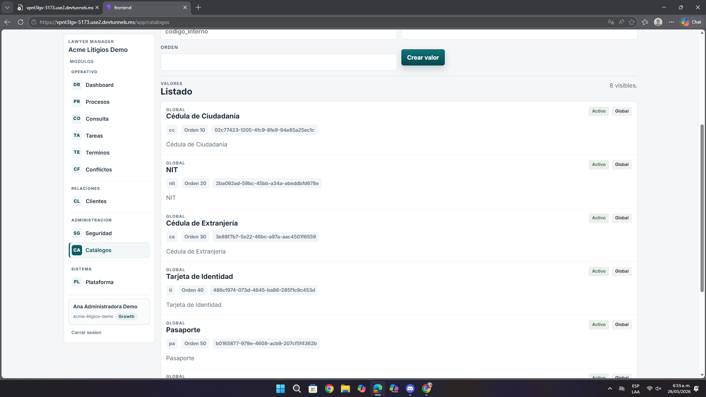

# Análisis de Pantalla – Catálogos

**Fecha:** 26 de mayo de 2026  
**Contexto:** Revisión de UI/UX, legibilidad y utilidad para administración  
**URL analizada:** `https://vpnt3lgv-5173.use2.devtunnels.ms/app/catalogos`  
**Archivo asociado:** `pantalla10.png`

---

## Resumen ejecutivo

La pantalla permite ver los valores del catálogo, pero expone demasiado contenido técnico y deja poco espacio para la acción práctica que el usuario realmente necesita realizar.

- Los identificadores ocupan demasiado protagonismo.
- Los estados se entienden, pero la acción es limitada.
- La lectura se siente más técnica que operativa.

---

## 1. Problemas detectados

| Observación | Impacto |
|-------------|---------|
| UUIDs y códigos internos compiten visualmente con el nombre del valor | El usuario ve demasiado dato técnico irrelevante para su tarea |
| La pantalla privilegia la lectura del dato sobre la acción | Administrar catálogos se vuelve más lento |
| Los badges `Activo` y `Global` ayudan, pero no bastan para guiar decisiones | Falta más contexto de uso o modificación |

---

## 2. Recomendaciones

- Ocultar identificadores técnicos por defecto.
- Priorizar el nombre funcional del valor y su descripción.
- Incorporar acciones rápidas visibles para editar, activar o desactivar.
- Hacer la pantalla más útil para administración diaria y menos para inspección técnica.

---

## 3. Lectura desde la experiencia del usuario

Desde la experiencia del usuario, la pantalla se siente correcta en contenido, pero desbalanceada en prioridad. Hay más esfuerzo dedicado a leer identificadores y menos ayuda visible para administrar el catálogo con rapidez.

---

## 4. Priorización

| Prioridad | Tipo | Acción |
|-----------|------|--------|
| **Media** | UX | Reducir el ruido técnico visible |
| **Media** | Operación | Agregar acciones rápidas |
| **Baja** | UI | Rebalancear jerarquía de información |

---

## Anexo – Evidencia visual

