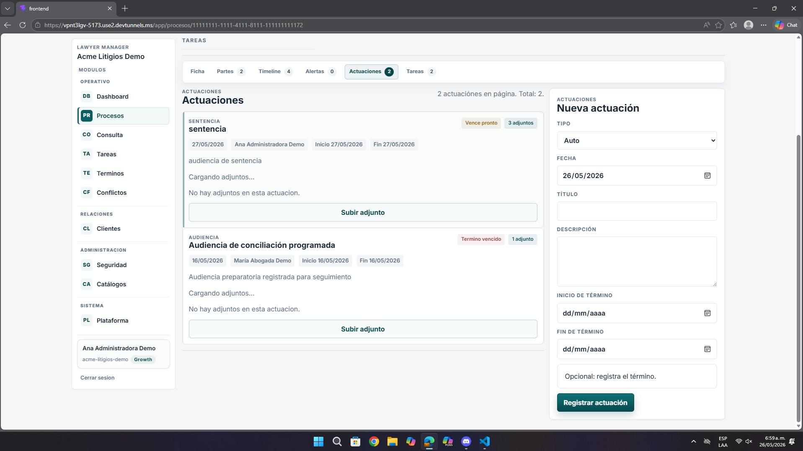
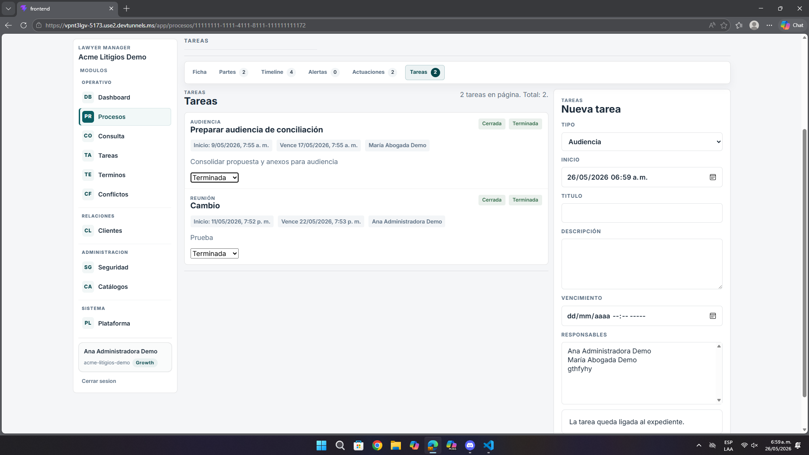

# Análisis de Pantalla – Actuaciones y Tareas del Expediente

**Fecha:** 26 de mayo de 2026  
**Contexto:** Revisión de UI/UX, formularios y seguimiento operativo  
**Ruta observada:** `https://vpnt3lgv-5173.use2.devtunnels.ms/app/procesos/{id}`  
**Relación con URLs principales:** esta vista nace desde `https://vpnt3lgv-5173.use2.devtunnels.ms/app/procesos`  
**Imágenes analizadas:** `pantalla12.png`, `pantalla12.1.png`

---

## Resumen ejecutivo

Las pantallas de actuaciones y tareas son funcionales, pero se sienten densas y exigen demasiada atención del usuario para completar, revisar o interpretar información que debería ser más directa.

- Los formularios ocupan mucho espacio y no priorizan tanto lo importante.
- Los estados y adjuntos no siempre se entienden rápido.
- La lectura de tareas terminadas o cerradas podría ser más clara.

---

## 1. Problemas en actuaciones

| Observación | Impacto |
|-------------|---------|
| El formulario lateral es largo y visualmente pesado | Registrar una actuación exige mucha concentración |
| El estado de adjuntos no es del todo claro | El usuario no sabe rápido si faltó carga o si no hay archivos |
| La lista de actuaciones comunica información útil, pero muy compacta | Hace más lenta la revisión del historial |

---

## 2. Problemas en tareas

| Observación | Impacto |
|-------------|---------|
| Las tareas muestran estados como `Cerrada` y `Terminada`, pero la diferencia no se explica | Puede generar interpretación ambigua |
| El formulario de nueva tarea sigue una lógica similar a actuaciones, con bastante peso visual | Crear tareas no se siente ligero |
| Los responsables y fechas tienen valor, pero no se jerarquizan con suficiente claridad | Cuesta identificar rápidamente qué importa más |

---

## 3. Recomendaciones

- Simplificar visualmente los formularios laterales.
- Explicar mejor estados y resultado de la carga de adjuntos.
- Dar más jerarquía a fechas, responsables y urgencia.
- Hacer más fácil distinguir revisión histórica versus creación de nuevos registros.

---

## 4. Lectura desde la experiencia del usuario

La sensación general es que el módulo sí funciona, pero obliga al usuario a procesar demasiada información a la vez. Eso no solo cansa visualmente, sino que vuelve menos ágil una parte del sistema que debería apoyar el seguimiento diario del caso.

---

## 5. Priorización

| Prioridad | Tipo | Acción |
|-----------|------|--------|
| **Alta** | Productividad | Reducir fricción en registro de actuaciones y tareas |
| **Media** | UX | Aclarar estados y adjuntos |
| **Media** | UI | Simplificar formularios y jerarquía visual |

---

## Anexo – Evidencia visual

