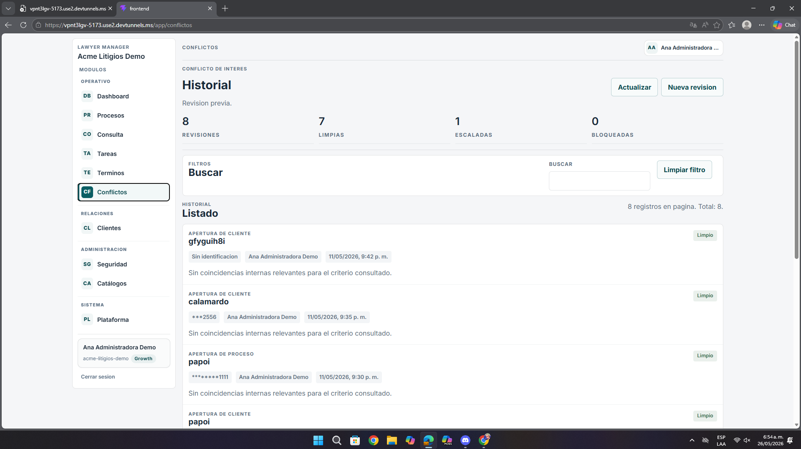
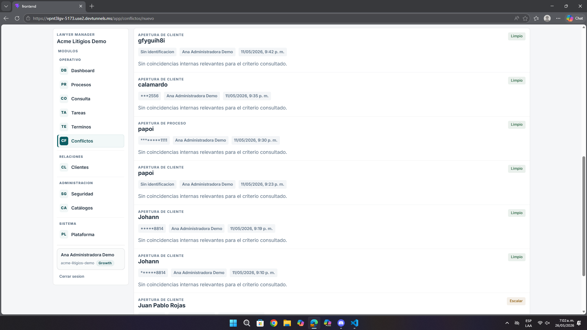
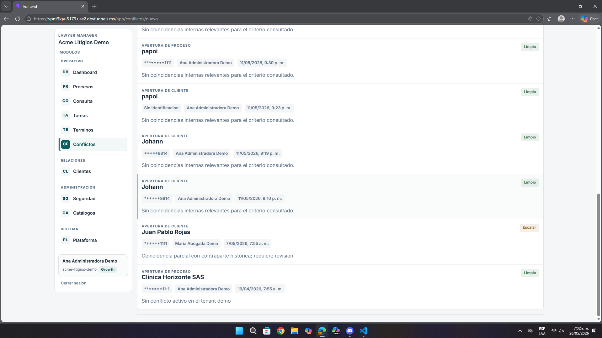

# Análisis de Pantalla – Conflictos / Historial de Revisión

**Fecha:** 26 de mayo de 2026  
**Contexto:** Revisión de UI/UX, legibilidad del historial y capacidad de decisión  
**URL analizada:** `https://vpnt3lgv-5173.use2.devtunnels.ms/app/conflictos`  
**Imágenes analizadas:** `pantalla9.png`, `pantalla9.1.png`, `pantalla9.2.png`

---

## Resumen ejecutivo

La pantalla cumple la función de mostrar el historial de conflictos, pero la lectura del listado exige demasiado esfuerzo y no ayuda con suficiente claridad a priorizar lo importante.

- Los registros tienen poco contexto visible.
- Hay demasiados elementos repetidos con muy poca diferenciación.
- El sistema comunica estados como `Limpio` o `Escalar`, pero no orienta bien qué hacer con ellos.

---

## 1. Problemas de comprensión del listado

| Observación | Impacto |
|-------------|---------|
| Muchos registros se ven visualmente iguales | Cuesta detectar cuál merece atención inmediata |
| Los nombres de apertura son breves o ambiguos | El usuario no reconoce rápido el caso correcto |
| La información complementaria se repite en líneas muy parecidas | El escaneo visual se vuelve lento |

---

## 2. Problemas de contexto para la decisión

| Observación | Impacto |
|-------------|---------|
| Estados como `Limpio` o `Escalar` aparecen, pero sin una explicación visible | El usuario puede no entender el criterio del sistema |
| No se resalta con suficiente fuerza el registro que sí requiere revisión | Se pierde prioridad operativa |
| Falta un resumen más claro del hallazgo por registro | Obliga a leer más para entender qué pasó |

---

## 3. Recomendaciones

- Hacer más visible la diferencia entre registros limpios, dudosos y escalados.
- Añadir más contexto útil en cada fila: tipo, coincidencia, fecha, gravedad y acción recomendada.
- Resaltar mejor el caso que requiere atención.
- Reducir la sensación de repetición dentro del listado.

---

## 4. Lectura desde la experiencia del usuario

El usuario sí recibe información, pero no necesariamente comprensión rápida. El módulo pide leer demasiado para distinguir lo normal de lo urgente, y eso debilita su utilidad como herramienta de decisión inmediata.

---

## 5. Priorización

| Prioridad | Tipo | Acción |
|-----------|------|--------|
| **Alta** | UX | Hacer más legible la priorización del historial |
| **Media** | UI | Diferenciar mejor estados y registros |
| **Media** | Copy | Explicar mejor qué significa cada resultado |

---

## Anexo – Evidencia visual

