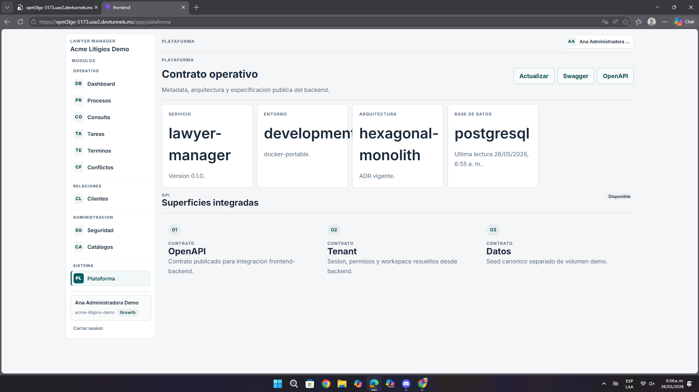

# Análisis de Pantalla – Plataforma / Contrato Operativo

**Fecha:** 26 de mayo de 2026  
**Contexto:** Revisión de UI/UX, documentación técnica y visibilidad de errores  
**URL analizada:** `https://vpnt3lgv-5173.use2.devtunnels.ms/app/plataforma`  
**Archivo asociado:** `pantalla8.png`

---

## Resumen ejecutivo

La pantalla aporta contexto útil del sistema, pero expone un error técnico visible que rompe la experiencia, interrumpe la lectura y reduce la confianza del usuario en la estabilidad general de la plataforma.

- El contrato operativo se entiende.
- La documentación OpenAPI falla.
- El mensaje técnico visible no orienta al usuario.

---

## 1. Problemas detectados

| Observación | Impacto |
|-------------|---------|
| Se muestra un error técnico crudo de OpenAPI/Swagger | Reduce la confianza en la plataforma |
| No hay una explicación amigable del fallo | El usuario no sabe cómo continuar |
| Los botones técnicos no indican claramente si hubo éxito o error | La experiencia parece inestable |

---

## 2. Recomendaciones

- Cambiar el error visible por un mensaje entendible para negocio.
- Registrar el detalle técnico en logs y no en la UI principal.
- Dar opciones como reintentar, ver versión raw o contactar soporte.

---

## 3. Lectura desde la experiencia del usuario

Aunque el usuario pueda entender parte del contrato operativo, la aparición de un error técnico tan explícito domina la percepción de la pantalla. En términos de experiencia, el problema ya no es solo visual, sino de confianza y credibilidad del sistema.

---

## 4. Priorización

| Prioridad | Tipo | Acción |
|-----------|------|--------|
| **Alta** | UX | Reemplazar el mensaje técnico visible |
| **Alta** | Confianza | Mejorar la comunicación del fallo |
| **Media** | Feedback | Aclarar el resultado de acciones técnicas |

---

## Anexo – Evidencia visual

