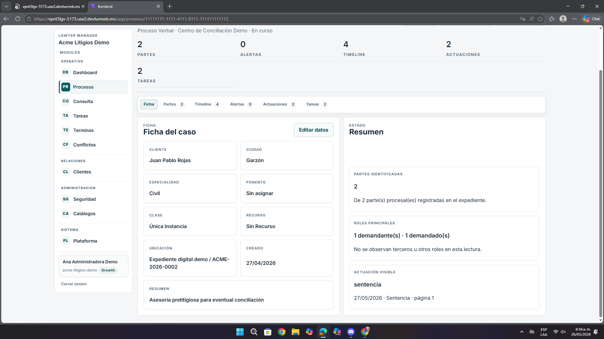
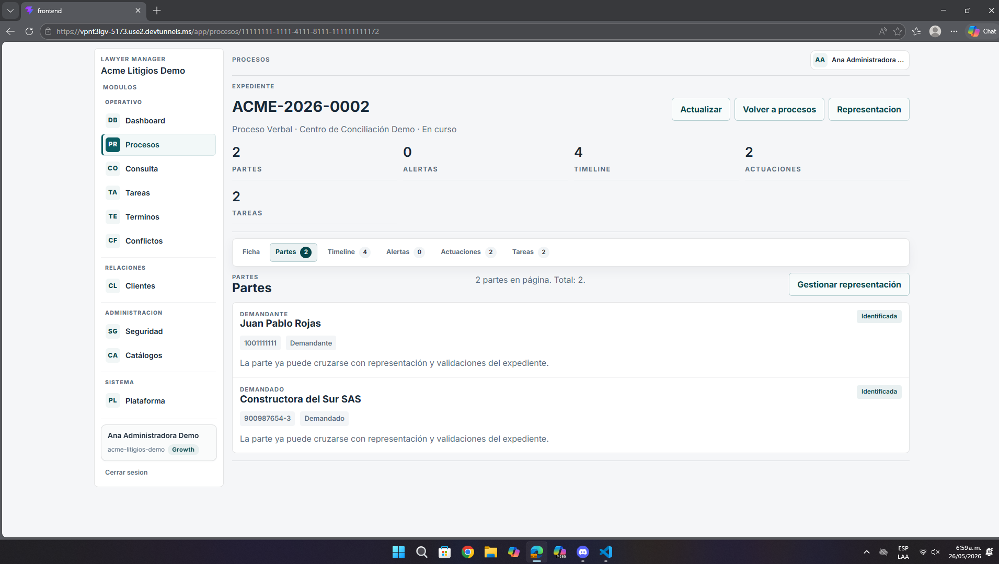
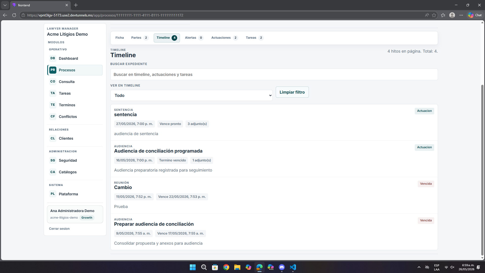

# Análisis de Pantalla – Expediente, Partes y Timeline

**Fecha:** 26 de mayo de 2026  
**Contexto:** Revisión de UI/UX, lectura del caso y navegación interna  
**Ruta observada:** `https://vpnt3lgv-5173.use2.devtunnels.ms/app/procesos/{id}`  
**Relación con URLs principales:** esta vista nace desde `https://vpnt3lgv-5173.use2.devtunnels.ms/app/procesos`  
**Imágenes analizadas:** `pantalla11.png`, `pantalla11.1.png`, `pantalla11.2.png`

---

## Resumen ejecutivo

Esta es una de las zonas más importantes del sistema. La base visual es buena, pero todavía hay oportunidades para hacer más clara la navegación y más rápida la interpretación del caso.

- La ficha del caso se entiende, pero compite con otras acciones.
- La pestaña de partes es útil, aunque su acción principal podría destacar mejor.
- El timeline contiene información valiosa, pero exige más lectura de la necesaria.

---

## 1. Ficha del caso

| Observación | Impacto |
|-------------|---------|
| La información está bien distribuida, pero el volumen sigue siendo alto | El usuario necesita más tiempo para escanear el caso |
| `Editar datos` compite con otros controles del encabezado | La acción principal no termina de dominar la pantalla |
| El resumen lateral aporta valor, pero no siempre guía la siguiente acción | Buena lectura, poca dirección operativa |

---

## 2. Partes del expediente

| Observación | Impacto |
|-------------|---------|
| La lista de partes es clara, pero la acción `Gestionar representación` queda separada del contenido | El flujo mental no se siente continuo |
| Los estados ayudan, pero podrían tener más fuerza visual | Cuesta identificar prioridad de revisión |
| El conteo arriba existe, pero no acelera tanto la lectura | El usuario sigue leyendo fila por fila |

---

## 3. Timeline

| Observación | Impacto |
|-------------|---------|
| Los hitos contienen información útil, pero son visualmente parecidos | Difícil priorizar un evento sobre otro |
| El filtro existe, pero no domina la experiencia | El usuario sigue enfrentando una lista larga |
| Los estados como `Vencida` o `Vence pronto` ayudan, pero podrían resaltar mejor | Riesgo de no detectar lo urgente de inmediato |

---

## 4. Recomendaciones

- Reforzar la acción principal en cada pestaña.
- Dar más contraste a eventos urgentes o críticos.
- Reducir el esfuerzo de lectura en el timeline con mejor agrupación visual.
- Hacer más evidente el flujo entre ficha, partes y seguimiento.

---

## 5. Priorización

| Prioridad | Tipo | Acción |
|-----------|------|--------|
| **Alta** | UX | Mejorar lectura operativa del expediente |
| **Media** | UI | Reforzar acciones clave por pestaña |
| **Media** | Seguimiento | Resaltar mejor eventos urgentes |

---

## Anexo – Evidencia visual

