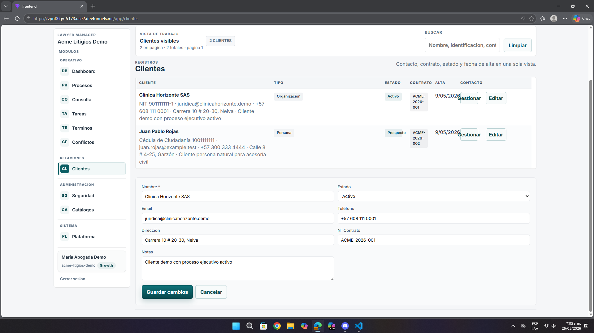

# Análisis de Pantalla – Clientes / Cartera de Clientes

**Fecha:** 26 de mayo de 2026  
**Contexto:** Revisión de UI/UX, maquetación y edición  
**URL analizada:** `https://vpnt3lgv-5173.use2.devtunnels.ms/app/clientes`  
**Archivo asociado:** `pantalla6.png`

---

## Resumen ejecutivo

La pantalla reúne la información necesaria para consultar y editar clientes, pero la distribución actual hace que varios datos y acciones queden demasiado juntos y obliguen al usuario a leer con más cuidado del deseado.

- Los datos largos compiten por espacio.
- `Gestionar` y `Editar` están muy próximos.
- El formulario y el listado podrían separarse mejor visualmente.

---

## 1. Problemas detectados

| Observación | Impacto |
|-------------|---------|
| Contacto, contrato y dirección se ven concentrados | La lectura se vuelve pesada |
| Botones de acción muy cercanos | Riesgo de clic accidental |
| El listado y el formulario comparten demasiado protagonismo | La pantalla se siente cargada |

---

## 2. Recomendaciones

- Dar más aire visual a las columnas del listado.
- Separar mejor las acciones principales.
- Marcar con más claridad la zona de edición respecto al listado.

---

## 3. Lectura desde la experiencia del usuario

El usuario sí puede completar la tarea, pero el camino no es tan fluido. La cercanía entre acciones y la densidad de datos hacen que la pantalla se sienta más administrativa que guiada, lo que aumenta la posibilidad de errores o lecturas lentas.

---

## 4. Priorización

| Prioridad | Tipo | Acción |
|-----------|------|--------|
| **Media** | UX | Mejorar lectura del listado |
| **Media** | UI | Separar mejor las acciones |
| **Media** | Maquetación | Diferenciar edición y consulta |

---

## Anexo – Evidencia visual

