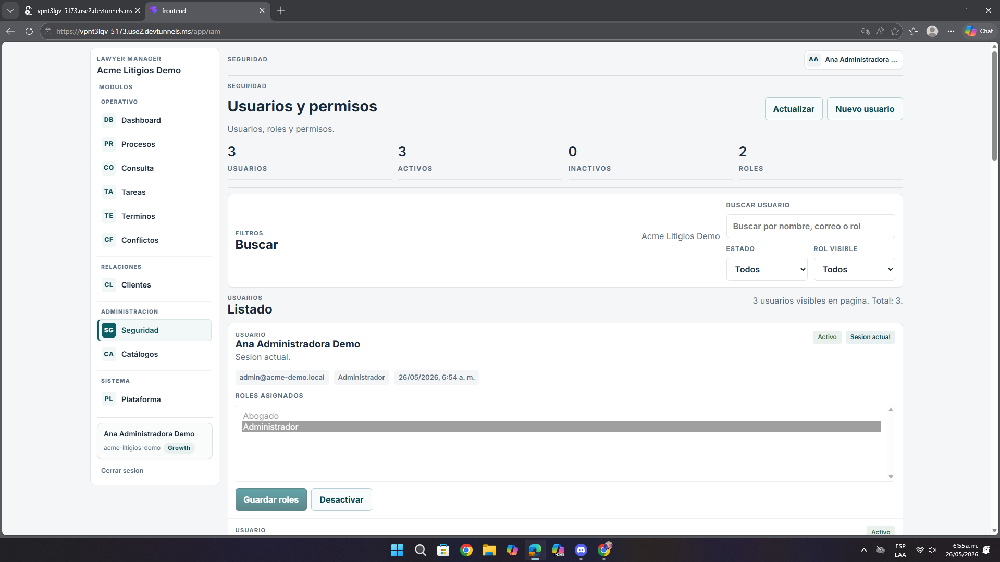

# Análisis de Pantalla – Seguridad (Usuarios y Permisos)

**Fecha:** 26 de mayo de 2026  
**Contexto:** Revisión de UI/UX, control operativo y acciones sensibles  
**URL analizada:** `https://vpnt3lgv-5173.use2.devtunnels.ms/app/iam`  
**Archivo asociado:** `pantalla7.png`

---

## Resumen ejecutivo

La funcionalidad es importante y sensible, y precisamente por eso la interfaz todavía necesita proteger mejor al usuario de errores operativos y decisiones tomadas con poca claridad.

- Roles y permisos ocupan mucho espacio visual.
- Las acciones críticas están demasiado cerca.
- Falta más feedback y confirmación en operaciones sensibles.

---

## 1. Problemas detectados

| Observación | Impacto |
|-------------|---------|
| El selector de roles no escala bien | Administrar permisos se vuelve pesado |
| `Guardar roles` y `Desactivar` están muy próximos | Riesgo de acción equivocada |
| Falta explicación del alcance de cambios | Menor confianza operativa |
| Se muestran datos sensibles del usuario sin matiz de entorno | Riesgo si el patrón se replica en producción |

---

## 2. Recomendaciones

- Añadir mejor estructura de búsqueda y filtrado para roles.
- Separar visualmente acciones seguras y destructivas.
- Pedir confirmación antes de desactivar.
- Mostrar feedback claro luego de guardar cambios.

---

## 3. Lectura desde la experiencia del usuario

Desde el punto de vista del usuario, esta pantalla exige atención alta porque combina información sensible con acciones de impacto. Cuando una vista así no diferencia con suficiente claridad lo seguro, lo crítico y lo confirmado, la sensación de riesgo aumenta.

---

## 4. Priorización

| Prioridad | Tipo | Acción |
|-----------|------|--------|
| **Alta** | Seguridad | Proteger mejor acciones sensibles |
| **Alta** | UX | Mejorar administración de roles |
| **Media** | Feedback | Confirmar guardado y desactivación |

---

## Anexo – Evidencia visual

